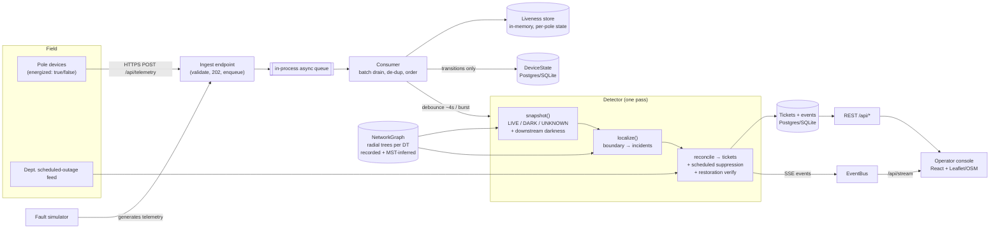

# Architecture

## 1. Data flow

The seed and simulator use a hidden **ground-truth** wiring; the detector never
sees it — it works only from telemetry + the registry, inferring the rest.

## 2. Ingestion — volume, ordering, duplication, failure

Devices `POST /api/telemetry` (single) or `/api/telemetry/batch`. The handler
validates, drops the message on an in-process `asyncio.Queue`, and returns `202`
— O(1), so a 5,000-message burst is absorbed without back-pressure. A background
consumer drains the queue in batches and updates the in-memory **liveness
store**, which owns correctness:

- **De-duplication.** `seq` is monotonic per device; an exact `(pole, seq)`
  repeat is dropped. At-least-once delivery and retries are therefore safe.
- **Ordering & clock skew.** Within a device the clock is internally consistent,
  so we order by device timestamp and never compare timestamps *across* devices
  (that is where the ±90 s skew lives, and it never matters to us). A message
  older than the current applied state (beyond a 90 s tolerance) is ignored for
  state — this drops out-of-order arrivals and 6-hour-late retries.
- **Boot resets.** `boot` resets `seq` to 0; we bump a boot epoch and always
  apply it. A pre-boot straggler is then recognised by its older timestamp and
  dropped, so a stale `power_lost` can't re-darken a restored pole.
- **Bursts.** Detection is *debounced* (~4 s) and coalesced, so thousands of
  messages from one outage collapse into a single localization pass.

Only **state transitions** (not 15-minute heartbeats) are mirrored to the DB, so
write volume tracks real events, not telemetry volume.

*Production note (NB-IoT → MQTT).* In the field, devices publish over NB-IoT to
an MQTT broker. The only change is the code *before* the queue: an MQTT
subscriber replaces the HTTP handler and puts the same dict on the same queue.
Everything downstream is unchanged. For multi-subdivision scale, swap the
in-process queue for Kafka/NATS partitioned by feeder; the detector shards per
feeder because faults never cross a feeder boundary (see §9).

## 3. Storage and the internal model

**The network is a tree.** The LT side is radial: every pole has exactly one
path to its DT, every DT one path to its substation. That single fact is the
whole design — we represent each DT's subtree explicitly as `parent`/`children`
maps rooted at the DT (`NetworkGraph`, built once at startup, held in memory).
A fault is an *edge*; sensors report *nodes*; localization is finding the
frontier edge between the live region and the dark region.

**Persisted schema (`models.py`):**

| Table | Purpose |
|-------|---------|
| `feeders`, `dts`, `poles` | Static registry (seeded). Poles keep the *exported* `seq_on_line`/`parent_pole_id` (null for 60% of DTs) and, for the simulator only, hidden `true_*` columns. |
| `device_state` | Compact last-known state per pole, written on transitions → restart recovery. |
| `scheduled_outages` | The mocked department feed. |
| `tickets`, `ticket_events` | Incident lifecycle + full audit trail. `reasons`/`affected_poles` are JSON. |

Volatile per-pole liveness lives in memory for the hot path; the DB is the
system of record for the registry and tickets. SQLite by default (zero
dependencies), PostgreSQL under compose/Render via `DATABASE_URL` — the same
SQLAlchemy models run on both.

## 4. The localization algorithm

Input: the `NetworkGraph` and a per-pole state map (`LIVE`/`DARK`/`UNKNOWN`).
Output: a small set of `Incident`s. All of this is pure and unit-tested
(`localization.py`, `tests/test_localization.py`).

**Step 0 — state, with downstream darkness (`state.py:snapshot`).**
A pole is `DARK` if it reported `energized:false`; `LIVE` if a *fresh* heartbeat
says energized; `UNKNOWN` if it has no device or has gone silent in isolation.
Crucially, **darkness propagates downstream**: a pole below a confirmed-dark
pole is dark too, even if its last (pre-fault) heartbeat said live — otherwise a
stale heartbeat would mask a real outage. The one exception: a descendant that
reported live *after* the upstream pole went dark is genuinely live (that's the
sensor-lie case, preserved for Step 3).

**Step 1 — DT-equipment fault.** If no device pole under a DT is live while some
are dark, the fault is the DT / HT fuse itself → one incident, not one per pole.

**Step 2 — span boundaries.** A **dark head** is a dark pole whose parent is not
dark. Each dark head is the frontier of one span fault; everything below it is
that one incident. This is how dozens of dark poles become one ticket. Two
independent faults on the same line produce two heads → two incidents (never
merged, never split). The failed span is `(parent-of-head → head)`.

**Step 3 — sensor lie.** A dark pole with a genuinely-live descendant is
physically impossible as a line fault (power reaches the descendant *through*
it). Classified as a `sensor` fault → maintenance queue, never an outage alert.

**Step 4 — missing devices → a range, not a point.** From a dark head we walk
upstream through device-less / silent poles to the first live pole (or the DT).
If the boundary crosses poles we can't observe, we report a **span range** and
say so, instead of a false-precision point.

**Step 5 — feeder rollup.** If every DT on a feeder is a full DT-fault, that's
one feeder incident, not N.

### The 60%-missing-topology answer

For DTs with recorded `seq_on_line`/`parent_pole_id` (~40%), we use it directly.
For the ~60% with none, **we infer the tree geometrically**: a Euclidean minimum
spanning tree (Prim) over the DT's poles rooted at the DT location, using pole
GPS (always present, ±4 m). A single line is recovered almost perfectly; the
failure mode is two lines running close together, where the MST can hop across
the street.

We do **not** claim uniform confidence. We estimate per-DT
**inference quality** by *perturbation stability*: rebuild the MST 6× with each
pole's coordinates jittered by the known ±4 m GPS error and measure how often
each pole keeps the same parent. Poles that flip are the genuinely uncertain
ones — exactly where 4 m decides which line a pole is on. This needs no ground
truth and uses the one error source whose magnitude we know.

Behaviour by regime, surfaced explicitly in the UI (badge: `RECORDED` /
`INFERRED`, and kind `SPAN` / `SPAN±` / `DT-AREA`):

| Topology | Answer | Confidence |
|----------|--------|-----------|
| Recorded | Span, pole-to-pole | base 0.90 |
| Inferred, quality ≥ 0.55 | Span (best-effort) | `0.5 + 0.4·quality` |
| Inferred, quality < 0.55 | **DT-area** (centroid of dark poles), no span claimed | capped ≤ 0.70 |

Validated offline against the simulator's hidden wiring on the seeded network:
geometric inference **recovers ~95% of true parents**, and the perturbation flag
catches **~85%** of the poles it gets wrong. Mean inference quality across
inferred DTs ≈ 0.93; the deliberately-hard parallel-line DTs drop to ~0.51 and
correctly fall back to DT-area.

### Confidence & why

Confidence starts from the topology base above and is adjusted by concrete,
reported factors, each emitted as a human-readable reason string:

- `+` a `power_lost` packet corroborated the darkness (vs. silence only, `−`);
- `−` the boundary crosses poles with no telemetry (→ range);
- `−` a boundary pole sits in a geometrically ambiguous (perturbation-unstable)
  cluster;
- `+` many downstream poles corroborate the same dark region.

Bands: ≥ 0.80 high, ≥ 0.55 medium, else low.

### Complexity & known failure cases

- Detection pass: **O(P)** over the poles of affected DTs (each visited a
  constant number of times). Topology inference: one-time **O(n²)** Prim per
  inferred DT at startup (n = poles on that DT, ≤ ~240).
- **Failure cases (documented, not hidden):**
  1. If *every* dying-gasp packet near the break is lost (fw-1.2 silent + the
     ~30% drop), the boundary snaps to the first pole that *did* report, so the
     span can be off by a pole or two downstream. Confidence drops accordingly.
  2. A whole-DT outage where the transformer-adjacent gasps all drop can look
     like a deep span. Rare; mitigated by corroboration count.
  3. An outage entirely on fw-1.2 poles with *no* `power_lost` anywhere is only
     detected on the slower silence-timeout path (~33 min), not the fast path.
  4. Geometric inference is wrong ~5% of the time; ~85% of those are flagged low
     confidence, ~15% are confidently wrong — the residual risk of the 60% case.

## 5. Noise handling / false-positive story

- **Dead sensor vs. real outage.** A single dark pole with live children is
  physically impossible → sensor fault, not an outage (Step 3). An isolated pole
  that merely goes silent (healthy neighbours) is treated as `UNKNOWN` — a
  likely dead modem — and never raises a ticket. The ~4% baseline offline fleet
  therefore produces zero alerts.
- **Scheduled outages (`scheduled.py`).** We do **not** treat the feed as
  gospel. An incident is suppressed (kept as a quiet `planned` ticket) only when
  the observed pattern falls under a planned DT/feeder window (+45 min grace for
  the routine overrun). If it is **still dark after the window elapses**, the
  detector **escalates** it to a real ticket — catching the ~1-in-10 cancelled
  window and any genuine fault that coincided with one.
- **Debounce.** A burst settles for ~4 s before we commit an answer, so we don't
  flap a ticket as symptoms trickle in out of order.

## 6. API surface

| Method | Path | Purpose |
|--------|------|---------|
| POST | `/api/telemetry` · `/api/telemetry/batch` | Ingest one / many telemetry messages. |
| GET | `/api/network/summary` · `/api/network/poles` · `/api/network/dts` | Network + live pole state for the map. |
| GET | `/api/tickets?scope=active\|planned\|closed` | Incident list (active sorted by households). |
| GET | `/api/tickets/{id}` | One ticket with its event timeline. |
| POST | `/api/tickets/{id}/acknowledge` · `/assign` · `/resolve` | Lifecycle actions (resolve is telemetry-checked). |
| GET · POST | `/scheduled-outages` | The mocked department feed (read + seed). |
| POST | `/api/sim/span` · `/dt` · `/feeder` · `/dead-sensor` · `/noise` · `/scheduled` · `/repair` · `/reset` | Fault simulator. |
| GET | `/api/stream` | Server-Sent Events (live ticket updates). |
| GET | `/api/health` · `/docs` | Health check · auto-generated OpenAPI (FastAPI). |

OpenAPI is generated by FastAPI at `/docs`, not hand-maintained.

## 7. UI reasoning

The operator is a non-engineer at 2 a.m. The screen answers, top to bottom:
**is something broken, where, how bad, what next.**

- **First thing that dominates:** the active-fault count (red when non-zero) and
  a list of incidents **ranked by households affected** — the operator triages by
  impact, not by arrival order.
- **Map and list work together:** clicking an incident flies the map to it and
  reveals *that DT's* poles coloured live/dark, so the boundary is visible.
  Bubble size = homes affected. We render only the focused DT's poles plus all
  dark poles network-wide — not all 3,150 markers — to stay legible and fast.
- **Ambiguity is shown, not hidden:** every incident carries a confidence band, a
  `RECORDED`/`INFERRED` badge, and a kind (`SPAN`/`SPAN±`/`DT-AREA`), plus a
  plain-language "why this location & confidence" list. A low-confidence inferred
  DT-area answer *looks* different from a pinned recorded span.
- **The dispatch briefing** (AI, §8) sits at the top of the detail panel: one
  sentence a tired operator can act on without decoding jargon.
- **Deliberately left off:** raw telemetry, per-device battery/RSSI, firmware
  versions, historical charts. They're in the data but they're noise for
  triage; burying the one thing that matters under diagnostics is how operators
  learn to ignore a system.
- **The decision I most expect to be wrong:** showing raw pole liveness on the
  map (a device whose gasp was lost shows green though the algorithm treats it
  dark). It's honest but can look inconsistent with the incident's pole count; a
  reviewer might prefer the map to show the *inferred* outage region. See
  DECISIONS.md.

## 8. The AI feature

**What:** a natural-language **dispatch briefing** — one calm sentence per new
ticket ("HIGH confidence — LT span fault between P-024431 and P-024432 on feeder
F-07-03; ~34 homes dark; navigate to 12.9682, 77.5946 (PIN 560078); dispatch a
line crew with LT conductor and a ladder"). It turns the localizer's structured
output + confidence reasons into something a non-engineer acts on instantly.

**Why here and nowhere else.** The localization itself is a deterministic graph
traversal — instant, free, explainable, testable. An LLM there would be slower,
costlier, non-deterministic, and unaccountable; **we deliberately do not use one
for localization** and would argue against it. The place an LLM genuinely earns
its keep is *phrasing* at the human interface, where fluency and tone matter and
correctness is still owned by the deterministic layer feeding it.

**Cost:** one short completion per *new* ticket (not per telemetry message) — a
few paise per fault at most; heartbeats never touch it.

**When it's unavailable or wrong:** it degrades to a deterministic template that
is always correct (just less fluent). No API key → template. Timeout/error →
template. The model never decides *where* the fault is and can never block
dispatch; it only rephrases facts it is handed. Enable it by setting
`OPENAI_API_KEY` (any OpenAI-compatible endpoint); otherwise the template is
used and the system is fully functional.

## 9. Would it extend from 1 subdivision to 30?

Mostly yes, and here's where it wouldn't. Faults never cross a feeder boundary,
so detection **shards cleanly per feeder** — the natural unit for horizontal
scaling. The stateless pieces (ingest, API, console) scale out trivially. What
would need work: the in-process queue and in-memory liveness store are
single-node; at 30× volume they become an external broker (Kafka partitioned by
feeder) and a shared fast store (Redis) or per-shard workers. The topology graph
is per-DT and embarrassingly parallel. The SQL schema is unchanged. So: the
*model* extends; the *single-process runtime* is the part that gets rewritten,
and it is isolated behind the queue on purpose.
